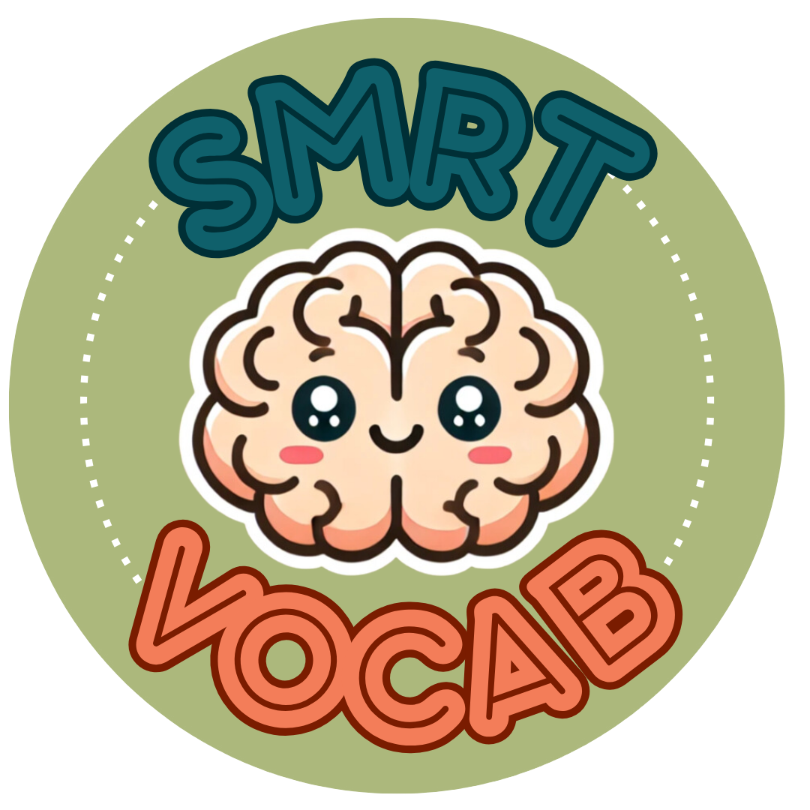

# SMRT Vocab

[](LICENSE)  
[](https://github.com/Inhuman-creation/SMRT-PROJECT/actions)  
[](#team-members)

## Table of Contents
- [Overview](#overview)
- [Features](#features)
- [Technologies Used](#technologies-used)
- [Developer Set-up Guide](#developer-set-up-guide)
- [Feature Development Guide](#feature-development-guide)
- [Team Members](#team-members)
- License:[ECL 2.0](https://opensource.org/license/ecl-2-0)
- [Acknowledgements](#acknowledgements)

---

## Overview

The Statistically Motivated Repetition Trainer, or **SMRT Vocab** is a collaborative project 
by **Lang Gang**, a team of seven developers from Texas A&M University - Corpus Christi. **SMRT Vocab** is a 
simple, easy to use vocabulary training with an algorithm based on modern language learning research, 
statistical linguistics, and spaced repetition. **SMRT Vocab** focuses on ease of use while supporting
efficiency and effectivity by cutting out complicated or gamified features. Here at **Lang Gang**, we believe
in increasing learners' target language proficiency through learning the most useful and frequent words
in an efficient and effective way so that they can enjoy understanding media and conversations 
in their target language.

---

## Features

- **Multiple-Choice Flashcards**: for learning words within the context of other words you are studying.
- **Text-Input Flashcards**: for encouraging deeper learning and memorization of individual words.
- **Review Mode**: for continued practice of your known vocabulary.
- **Text-to-Speech**: for accessibility and learning the pronunciation of words.
- **Settings**: for customizing your unique learning needs.
- **Scalable Language Support**: **SMRT Vocab** supports easily adding new languages to learn through
importing CSV frequency dictionaries.
- **Supported Languages**: **SMRT Vocab** currently supports Spanish, French, Arabic, and Japanese language learning.

---

## Technologies Used

| **Tech/Framework** | **Role**                    |
|--------------------|-----------------------------|
| Python             | Main programming language   |
| Tkinter/CTkinter   | GUI Toolkit                 |
| Pygame             | Sound playback              |  
| Pillow             | Image loading               |
| GoogleTTS          | Text-to-Speech              |
| Git                | Distributed version control |
| GitHub             | Git hosting platform        |

---

## Developer Set-up Guide
1. Install the latest 64 bit version of [python](https://www.python.org/downloads/)
2. Install [PyCharm](https://www.jetbrains.com/pycharm/download/?section=windows)
3. In PyCharm [connect your Python interpreter](https://www.jetbrains.com/help/pycharm/configuring-python-interpreter.html)
   1. Click "\<No interpreter\>" in the bottom right of PyCharm
   2. If you see your Python interpreter displayed, click it. Else, continue
   3. Click "Add New Interpreter >"
   4. Click "Add Local Interpreter..."
   5. In the pop-up window, select the "Existing" radio button
   6. On Windows machines, enter "C:\Windows\py.exe" in the "location" text box
   7. Press OK in the bottom right to close the pop-up
4. Install required packages with pip:
	* Windows: Run setup.bat
	* MacOS/Linux: Run setup.sh

## Feature Development Guide
The following steps should be taken to add a new feature to the Main Menu. FeatureGUI will act as a placeholder name for an actual feature.
1. Make a new .py file in the main directory of the project and name it FeatureGUI.py 
2. Inside of the newly created Python file, make a class titled the same as its file. For example, `class FeatureGUI()`
3. FeatureGUI's init function should look like this: `def __init__(self, controller):`. 
	- `controller` will usually refer to the instance of the GUI class from Main.py
4. Import the `FeatureGUI` at the top of Main.py. Example: `from FeatureGUI import FeatureGUI`
	- FYI the first time `FeatureGUI` is typed here, it refers to the file or module. The second time, it refers to the class
5. In Main.py, at the bottom of the GUI class' `__init__()` function, create a function named `show_feature_gui(self)` Example:
```python
	def show_feature_gui(self):
		if self.current_frame:
			self.current_frame.destroy()
		self.current_frame = FeatureGUI(self)
```
6. In MenuGUI.py, replace a placeholder or create a new CTkbutton that has its command set to `controller.show_feature_gui()`
7. Implement your feature as described in the Software Requirements Specification. Don't forget to give the user a button to go back or to the Main Menu

---

## Team Members

| **Name**             | **Role**              | **GitHub**                                               |
|----------------------|-----------------------|----------------------------------------------------------|
| **Voss Purkey**      | Project Manager       | [@Vangsvatnet](https://github.com/Vangsvatnet)           |
| **Ryleigh Sibley**   | Technical Manager     | [@ryleighds](https://github.com/ryleighds)               |
| **Malak Mahdy**      | Requirements Manager  | [@malakamahdy](https://github.com/malakamahdy)           |
| **Garrett Strader**  | Design Manager        | [@Inhuman-creation](https://github.com/Inhuman-creation) |
| **Zachary Kao**      | Test Manager          | [@zkao08](https://github.com/zkao08)                     |
| **Jacob Poland**     | Configuration Manager | [@JacobDPoland](https://github.com/JacobDPoland)         |
| **Marcelo Barahona** | Software Engineer     | [@MBarahona388](https://github.com/MBarahona388)         |

---

## License

This project is licensed under the **MIT License** - see the [LICENSE](LICENSE) file for details.

---

## Acknowledgements

Special thanks to Texas A&M - Corpus Christi and Dr. Kadir Alpaslan Demir for providing us
with an environment to learn Software Engineering.
